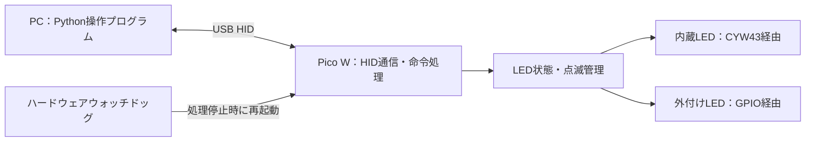

# Pico W HID LED制御 基本設計

- 作成日：2026-10-04
- 対象：PC上のPythonプログラムおよびRaspberry Pi Pico W
- 文書の位置付け：合意済み要件と、それを実現するための基本設計案
- 実装状況：Pico側ファームウェア0.2.0を実装。通信のバイト定義は[HID_PROTOCOL.md](HID_PROTOCOL.md)、ビルド・書き込み手順は[README.md](README.md)を参照。

## 1. 目的・確定要件

PC上のPythonからUSB HID通信でPico Wを操作し、内蔵LEDと外付けLED数個を制御する。

| 項目 | 要件 |
|---|---|
| 操作元 | PC上のPythonプログラム |
| 通信方式 | USB HIDによる有線通信 |
| 制御対象 | Pico W内蔵LEDと外付けLED数個 |
| LED操作 | LEDごとにON・OFF・点滅を個別に指定 |
| 点滅処理 | Pico W側で実行し、LEDごとに点灯時間・消灯時間を管理 |
| 指示の上書き | 新しい指示で、対象LEDの以前の指示を置き換える |
| 点滅開始 | 点滅指示を受けたら点灯から開始 |
| Picoの停止対策 | ハードウェアウォッチドッグで再起動 |
| 通信タイムアウト監視 | 設けない。HEARTBEATコマンドも設けない |
| 通信途絶時 | 給電が続いている場合、最後に設定した点灯・点滅を継続 |
| 起動・再起動時 | 全消灯し、新しい指示を待つ |

Pythonから定期的に通信する必要はない。LEDの状態を変更するときに指示を送る。

## 2. 全体構成



| 構成要素 | 採用案 | 役割 |
|---|---|---|
| PC側 | Python＋hidapiパッケージ（`import hid`） | 接続、命令送信、応答確認、状態取得 |
| Pico W側 | Pico C/C++ SDK | LED制御、時刻管理、ウォッチドッグ |
| USB通信 | TinyUSB Generic HID IN/OUT | 独自形式の命令・応答を転送 |
| 実行方式 | 単一コアのメインループ、RTOSなし | 通信と複数LEDの点滅を短い処理で順次実行 |

Wi-Fi接続は使用しない。内蔵LEDを操作するため、CYW43用ライブラリを使用する。

## 3. LEDと配線

PythonからはGPIO番号ではなく、論理的なLED番号で指定する。LED番号と接続先の対応はPico側の設定にまとめる。

| LED番号 | 接続先の案 | 備考 |
|---|---|---|
| 0 | Pico W内蔵LED | CYW43のLED用GPIO |
| 1 | GP2 | 外付けLED |
| 2 | GP3 | 外付けLED |
| 3 | GP4 | 外付けLED |
| 4 | GP5 | 外付けLED |

初期実装は外付け4個、GP2～GP5の割り当てとする。実際の個数と配線に合わせて`app_config.h`で変更できる。

外付けLEDは、次の接続を基本とする。

```text
Pico W GPIO ─ 電流制限抵抗 ─ LEDアノード → LEDカソード ─ GND
```

- GPIO出力がHIGHで点灯する接続とする。
- LEDごとに電流制限抵抗を設ける。抵抗値はLEDの順方向電圧と目標電流から決める。
- 表示用LEDは数mA程度を目安にし、端子ごと・全体の電流制限内に収める。
- 外付けLEDは通常のGPIO API、内蔵LEDはCYW43 APIで操作する。実装ではエラーを確認できる`cyw43_gpio_set()`を使用する。
- 初期対応はON・OFF・点滅とする。明るさ調整は今回の必須要件に含めない。

## 4. LEDの動作仕様

### 4.1 操作モード

| モード | 動作 |
|---|---|
| ON | 点灯し、その状態を維持する |
| OFF | 消灯し、その状態を維持する |
| BLINK（点滅） | 指定した点灯時間・消灯時間で繰り返す |

各LEDに、モード・点灯時間・消灯時間・現在の出力状態・点滅開始時刻を保持する。

### 4.2 指示を受けたときの動作

- 指示は対象LEDにだけ適用し、他のLEDの状態や点滅タイミングを変更しない。
- ONまたはOFFを受けた場合、対象LEDの点滅を解除し、指定状態にする。
- BLINKを受けた場合、点灯から開始し、指定した点灯時間の経過後に消灯する。
- 点滅中に新しいBLINKを受けた場合も、新しい条件で点灯から開始する。
- 点灯時間・消灯時間の単位はミリ秒とする。初期実装では各10～3,600,000msを受け付け、0や範囲外の値は拒否する。
- 不正な指示ではLEDの設定を変更せず、エラー応答を返す。
- 設定はRAMに保持し、起動・再起動後には復元しない。

### 4.3 点滅の実行

点滅はPico側の64ビットの単調増加時刻を用いて実行する。長い待ち時間を使わず、開始時刻からの経過時間を点滅周期で割った余りから現在の位相を求める。処理が遅れても、過去の切り替えを繰り返して追いかけない。

これにより、異なる周期で点滅する複数のLEDとHID通信を同時に処理する。実際の切り替え精度はメインループの処理時間に依存するため、受付下限の10msでの精度は実機で確認する。

## 5. HID通信仕様

### 5.1 通信方式

| 項目 | 設計案 |
|---|---|
| HID種別 | Vendor-defined Usage Pageを使用するGeneric HID |
| インターフェース | HID 1個、Interrupt OUTとInterrupt IN |
| PC→Pico | Output Reportで命令を送信 |
| Pico→PC | Input Reportで応答を送信 |
| データ長 | 送受信とも64バイト固定 |
| Report ID | 使用しない |
| 機器識別 | VID／PID、Usage Page／Usage、製品名で候補を絞り、USBシリアル番号で個体を選択 |
| 命令の扱い | 原則として1命令ずつ送信し、対応する応答を確認 |

HIDAPIの書き込みには、64バイトの命令データの前に`0x00`を付け、合計65バイトを渡す。この先頭バイトは、Report IDなしの機器に対するHIDAPIの指定であり、Picoが解釈する命令データには含めない。読み込みでは64バイトの応答データを扱う。

### 5.1.1 個人試作用のUSB識別値・表示名

配布・販売を行わない個人の試作環境向けに、次の値を採用する。

| 項目 | 採用値 | 意味・選定理由 |
|---|---|---|
| VID | `0x1209` | pid.codesのVID。下記のテスト用PIDとの組み合わせで使用 |
| PID | `0x0001` | pid.codesが私的なテスト用に提供する共有PID |
| Usage Page | `0xFF00` | ベンダー独自定義の用途に使うページ |
| Usage | `0x0001` | 最上位Application Collectionを、この設計ではLED制御用として定義 |
| 製品名（iProduct） | `Hid_blinker_Pico` | プロジェクト名に合わせたUSB製品名文字列 |
| 製造元名（iManufacturer） | `Personal Project` | 個人の試作であることを示す文字列 |
| シリアル番号（iSerialNumber） | `PICOLED-<ボード固有IDの16進表記>` | 再接続・複数台接続時の個体識別。起動ごとに変えない |

`1209:0001`は固有の製品IDではなく、他の試作機も使う共有テストIDである。pid.codesの条件に従い、配布・販売・製造する機器には使わず、ソースコードや設定にも「一意ではないテスト専用ID」であることを明記する。配布へ進む場合は使用可能な固有IDへ変更する。[テスト用IDの使用条件](https://pid.codes/1209/0001/)

Usage Page `0xFF00`とUsage `0x0001`の組み合わせは、TinyUSBの`TUD_HID_REPORT_DESC_GENERIC_INOUT`と同じ構成である。`0x0001`がUSB規格上「LED制御」を意味するわけではなく、この機器の独自用途として定義する。UsageはLED番号やReport IDとは別であり、各LEDへの操作は命令データ内のLED番号とモードで指定する。[TinyUSBのHID記述子定義](https://github.com/hathach/tinyusb/blob/master/src/class/hid/hid_device.h)

このテンプレートでは、レポート内部のInputデータにUsage `0x0002`、OutputデータにUsage `0x0003`を使用する。Pythonから機器を選ぶときに確認するUsageは、最上位Collectionの`0x0001`である。

シリアル番号はPico SDKで取得できるボード固有IDから生成する。全てのボードに同じ固定文字列を設定しない。製品名はUSBの製品名文字列として設定し、Python側でも機器選択に使用する。

Python側は次の順序で接続先を選ぶ。

1. VID `0x1209`／PID `0x0001`で候補を列挙する。
2. Usage Page `0xFF00`／Usage `0x0001`、製品名`Hid_blinker_Pico`で絞り込む。
3. シリアル番号が指定されていれば一致する個体を選び、そのデバイスパスで接続する。
4. シリアル番号の指定がなく候補が1台ならその個体へ接続する。複数台なら自動で先頭を選ばず、シリアル番号の指定を求める。
5. 候補がない場合は未接続として扱う。

上記の識別値・文字列はPico側とPython側で一致させる。

### 5.2 命令と応答

主要命令は`SET_LED`とする。

| 項目 | 内容 |
|---|---|
| 仕様バージョン | 通信仕様の互換性確認に使用 |
| 命令番号 | `SET_LED`などの処理を指定 |
| 通番 | 命令と応答の対応付けに使用 |
| LED番号 | 操作対象のLEDを指定 |
| モード | ON・OFF・BLINK |
| 点灯時間 | BLINK時の点灯時間（ms） |
| 消灯時間 | BLINK時の消灯時間（ms） |

ON／OFFでは時間フィールドを0で送信し、Pico側では使用しない。各フィールドのバイト位置、幅、数値コードは[HID_PROTOCOL.md](HID_PROTOCOL.md)に定義する。複数バイト整数はリトルエンディアンとする。

Picoは受信したデータ長、仕様バージョン、命令番号、LED番号、モード、時間の妥当性を確認してから設定を適用する。応答には通番と処理結果を含め、失敗時には原因を返す。

成功応答は設定を受理・反映したことを示す。LEDの断線や実際の発光状態を検出する機能は含まない。

### 5.3 補助命令

| 命令 | 用途 |
|---|---|
| `GET_STATUS` | 指定LED1個の設定・出力状態、ファームウェア情報、再起動原因を取得 |
| `ALL_OFF` | 全LEDを消灯し、全ての点滅設定を解除 |
| `SET_ALL` | 全LEDのON／OFFをまとめて設定 |

上記3つを初期実装に含める。`HEARTBEAT`および通信途絶による自動消灯機能は設けない。

## 6. Python側の操作API

以下は作成予定の操作クラスの使用イメージであり、実装済みAPIではない。

```python
led.on(0)                            # 内蔵LEDを点灯
led.off(1)                           # 外付けLED 1を消灯
led.blink(2, on_ms=500, off_ms=500)    # 外付けLED 2を点滅
led.blink(3, on_ms=100, off_ms=900)    # 外付けLED 3を別周期で点滅
```

Python側の操作クラスは、次を担当する。

- 対象機器の列挙・接続・切断。
- 引数の検証とHIDデータへの変換。
- 通番を用いた応答の照合とエラー通知。
- 同時呼び出しがあっても、命令と応答が混在しないよう送受信を直列化。
- Pico再起動後の再探索・再接続。

応答待ちには上限を設け、PC側の呼び出しが無期限に停止しないようにする。これは通信APIのエラー処理であり、Pico側でLEDを消灯・再起動させる通信タイムアウト監視とは別である。

接続を閉じた場合やPythonが終了した場合も、Picoへの給電が続いていればLEDの動作を維持する。消灯して終了したい場合は、終了前に明示的なOFF指示を送る。

再接続だけでは以前の指示を自動再送しない。必要に応じて状態を取得し、新しい指示を送る。

## 7. Pico側の処理構成

責務を次の単位に分ける。対応ファイルは[README.md](README.md)に記載する。

| 処理部 | 役割 |
|---|---|
| 初期化・メインループ | 初期化順序と各処理の実行を管理 |
| USB／HID通信部 | USB記述子、受信データの受け渡し、応答送信 |
| 命令処理部 | データ検証、命令の解釈、応答の組み立て |
| LED制御部 | LED番号と接続先の対応、モード管理、点滅処理 |
| ウォッチドッグ処理部 | WDT設定、正常進行時の更新、再起動原因の取得 |

メインループでは次の処理を短時間で繰り返す。

1. TinyUSBの通信処理を実行する。
2. CYW43をポーリングし、各LEDの現在の点滅位相を更新する。
3. 受信命令を検証してLED設定を更新し、変化した出力をハードウェアに反映する。
4. 応答を送信可能であれば送信する。
5. 各処理が正常に一巡した場合にウォッチドッグを更新する。

命令が届かない場合もLED処理とウォッチドッグ更新を継続する。送信先PCの読み取り待ちや大量の受信処理で、メインループを無期限に停止させない。HIDコールバックでは長い処理を行わず、受信データを主処理へ渡す。

## 8. ウォッチドッグと復帰動作

### 8.1 監視方式

RP2040のハードウェアウォッチドッグを使用し、Pico側の処理停止から復帰させる。

| 項目 | 初期案 |
|---|---|
| 通常動作中のWDT期限 | 2秒 |
| 初期化中のWDT期限 | 5秒 |
| 更新条件 | メインループの必要処理が正常に一巡したこと |
| 更新箇所 | メインループ末尾 |
| 期限超過時 | Picoを再起動 |

期限は実機測定後に調整する。割込みや別処理からの無条件更新は行わない。USB接続や命令受信の有無は、WDTの更新条件に含めない。

### 8.2 起動順序

1. 再起動原因を取得する。
2. 外付けLEDのGPIOを消灯状態で初期化する。
3. 初期化用の期限でWDTを有効にする。
4. CYW43を初期化し、内蔵LEDを明示的に消灯する。
5. USB HIDとLED管理状態を初期化する。
6. 通常動作用のWDT期限に設定し、全消灯で命令を待つ。

初期化に失敗した場合は通常動作へ進まず、外付けLEDの消灯状態を保つ。WDTを無条件に更新し続けず、再起動による復帰を試みる。

### 8.3 状況ごとの動作

| 状況 | 動作 |
|---|---|
| Pythonから命令が来ない | 現在の点灯・点滅を継続 |
| Python終了・異常停止 | 給電が続いていれば現在の点灯・点滅を継続 |
| USB通信切断・PCスリープ | 給電が続いていれば現在の点灯・点滅を継続 |
| USB抜去により給電も停止 | Picoは停止。次回の電源投入時は全消灯から開始 |
| 不正な命令を受信 | 設定を変更せずエラーを返す |
| Picoの主処理停止 | WDT期限超過で再起動し、全消灯から開始 |
| 通信再接続 | 接続だけではLED状態を変更しない |

WDTは、誤った処理をしながら更新を続ける種類の暴走までは検出できない。内蔵LEDはCYW43側に接続されているため、RP2040のリセット瞬間に消灯することは保証せず、再初期化後に明示的に消灯する。

## 9. 実装状況

内蔵LEDを250ms点灯・250ms消灯する初期コードを、HID制御ファームウェアへ変更した。

Pico側の実装内容は次のとおり。

- 待ち時間を使う点滅処理を、時刻比較による複数LED管理へ変更。
- 外付けLEDのGPIO設定を追加。
- TinyUSBのHID設定、USB記述子、命令・応答処理を追加。
- WDTの有効化、正常進行時の更新、再起動原因取得を追加。
- ハードウェアに依存しないLED状態管理・命令処理と、USB受信・応答処理のホストテストを追加。

Python側の操作クラスは次の工程とする。USB列挙、実際のLED点灯、WDTのリセット時間などは実機確認が必要。

## 10. 実機確認項目

1. 内蔵LED・各外付けLEDに対して、ON・OFF・点滅を個別に指定できること。
2. 複数LEDが異なる周期で点滅し、あるLEDへの指示が他のLEDに影響しないこと。
3. 点滅は点灯から始まり、ON／OFFや新しい点滅条件で正しく上書きされること。
4. 不正な番号・モード・時間・データ長で状態を変更せず、エラーを扱えること。
5. Python終了後、Picoへの給電が続けば点灯・点滅を維持すること。
6. 給電を維持した通信切断・PCスリープで、意図しない消灯や再起動が発生しないこと。
7. Picoの主処理を意図的に停止するとWDTで再起動し、全消灯になること。
8. Pico再起動後にPythonから再接続でき、過去の点灯設定が自動復元されないこと。
9. 通常動作および初期化中に、WDTの誤作動による再起動が起きないこと。

## 11. 実機に合わせて調整・確認する項目

- 外付けLEDの個数、種類、GPIO割り当て、抵抗値。
- 点灯時間・消灯時間の受付範囲と、必要な時間精度。
- Python側の応答待ち時間。
- 初期化中・通常動作中のWDT期限の実測確認。

## 12. 参考資料

- [Raspberry Pi公式LEDサンプル](https://github.com/raspberrypi/pico-examples/blob/master/blink/blink.c)
- [Pico SDK：CYW43 API](https://www.raspberrypi.com/documentation/pico-sdk/networking.html)
- [Pico SDK：watchdog API](https://github.com/raspberrypi/pico-sdk/blob/master/src/rp2_common/hardware_watchdog/include/hardware/watchdog.h)
- [TinyUSB：Generic HID IN/OUT](https://docs.tinyusb.org/en/latest/examples/device/hid_generic_inout.html)
- [Python用hidapi](https://github.com/trezor/cython-hidapi)
- [HIDAPI：API仕様](https://libusb.info/hidapi/group__API.html)
- [pid.codes：個人試作用VID／PIDの条件](https://pid.codes/1209/0001/)
- [TinyUSB：HID記述子テンプレート](https://github.com/hathach/tinyusb/blob/master/src/class/hid/hid_device.h)
